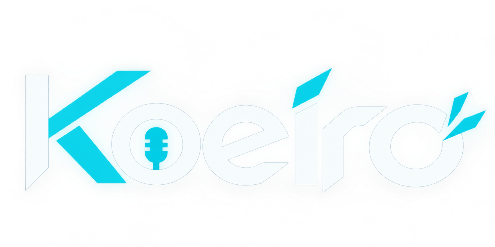

<p align="center">
  
</p>

<h1 align="center">Koeiro（声彩）</h1>

<p align="center">
  <strong>登録した声へリアルタイムに変換する次世代AIボイスチェンジャー</strong><br>
  Windows 10/11 & Linux 対応 ｜ MeanVC2 + LavaSR 帯域復元 ｜ Discord RPC 連携
</p>

<p align="center">
  
  
  
  
</p>

---

## 📖 概要

**Koeiro（声彩 / こえいろ）** は、マイクから入力された音声をリアルタイムで目的の声へと変換するAIボイスチェンジャーです。

最先端の軽量音声変換モデル **MeanVC2** に加え、高品質な超解像・帯域復元技術 **LavaSR** を統合。配信（OBS）、通話（Discord / Zoom）、VRプラットフォームなどに向けて、低遅延かつ高品位なボイス変換を提供します。

GUIとAI推論ワーカーをプロセス分離する設計を採用しており、GUI側の軽快な動作とAI処理の安定稼働を両立しています。

---

## ✨ 主な機能

- **複数の変換モードを用途に合わせて選択可能**
  - **逐次変換（Streaming）**: 発話を話しながら順次低遅延で変換。リアルタイムな通話・ゲームプレイに最適。
  - **一括変換（LavaSR 高音質）**: 0.8秒の無音区間で発話を自動分割し、文全体を変換後に LavaSR で高域を復元（最大60秒）。数秒待つ代わりに極めて自然で明瞭な音質を実現。
  - **一括変換 - 最速**: 判定待ち時間を約0.6秒まで短縮したレスポンス重視のバッチ変換モード。
  - **Original / Female DSP**: AIを介さない素通し（スルー）モードおよび軽量なDSPフォルマント・ピッチ加工。
- **直感的な声の登録 & 切り替え**
  - 数十秒〜数分の音声ファイルを登録するだけで、自分好みの声色・キャラクターボイスを即座に作成・選択可能。
- **Discord Rich Presence（アクティビティ表示）対応**
  - Discord のステータス欄に「Koeiro で変換中」「使用中のボイス名」をリアルタイム表示。
- **柔軟な推論デバイス対応**
  - NVIDIA GPU（CUDA）での高速推論に対応。GPU非搭載環境でも自動でCPUフォールバック動作。
  - 品質のブレを防ぐため TF32 を明示的に無効化し、再現性の高い音声出力を維持。
- **GUI完結の自動アップデート & 初回ウィザード**
  - 初回起動時のマイク／仮想オーディオ設定ガイドを搭載。
  - 「設定 → アプリの更新」から GitHub Releases の最新版をワンクリックで更新可能。

---

## 🛠️ 動作要件

| 項目 | 要件 |
| :--- | :--- |
| **OS** | Windows 10 / 11, Linux (Ubuntu 22.04+ 推奨) |
| **Python** | 3.12 系 |
| **必要容量** | 空き容量 約8GB 以上（作業環境＋AIモデル群） |
| **外部ツール** | **FFmpeg**（音声読込用）、**git**、**uv** |
| **Linux 追加依存** | `libportaudio2`, `portaudio19-dev` |
| **仮想音声デバイス** | 変換音を出力するための仮想オーディオデバイス（任意）<br>・Windows: [VB-CABLE](https://vb-audio.com/Cable/) 等<br>・Linux: `snd-aloop`（ALSA Loopback）等 |

---

## 🚀 クイックスタート（推奨：リリース版）

一般ユーザー向けには、[GitHub Releases](https://github.com/heynegix/koeiro/releases) から配布されているパッケージの利用を推奨します。

### Windows の場合
1. Releases から `koeiro-vX.Y.Z-windows.zip` をダウンロードし、任意のフォルダ（※英数字のみのパス推奨）に展開。
2. PowerShell を開き、展開先ディレクトリで以下を実行（初回のみ）：
   ```powershell
   py -3.12 tools/setup_release.py
   ```
3. セットアップ完了後、アプリを起動：
   ```powershell
   .\.venv\Scripts\python app.py
   ```

### Linux の場合
1. Releases から `koeiro-vX.Y.Z-linux.tar.gz` をダウンロードして展開。
2. ターミナルで以下を実行（初回のみ）：
   ```bash
   sudo apt install -y libportaudio2 portaudio19-dev ffmpeg
   python3.12 tools/setup_release.py
   ```
3. セットアップ完了後、アプリを起動：
   ```bash
   .venv/bin/python app.py
   ```

> [!TIP]
> アプリ起動後は「設定 → オーディオ設定」で **入力デバイス（マイク）** と **出力デバイス（VB-CABLE やヘッドホン等）** を指定してください。

---

## 🤖 AIエージェントによる自動セットアップ（Codex / Claude Code 用）

Claude Code や Codex などの自律型CLIエージェントをご利用の場合は、下記プロンプトをそのまま貼り付けることで環境構築から疎通確認までを自動実行できます。

<details>
<summary>📋 コピペ用プロンプトを開く</summary>

```text
https://github.com/heynegix/koeiro をセットアップしてください（ボイスチェンジャー Koeiro）。
まず作業用ディレクトリ（例：ホーム直下のkoeiro。英数字のみのパス推奨）に
`git clone https://github.com/heynegix/koeiro` して、そこを作業場所にしてください。
同名のディレクトリが既にある場合は中身を確認し、別名でcloneしてから報告してください。
特定の版が必要な場合のみ `git clone --branch vX.Y.Z` を使ってください。
OSを判定し、WindowsならPowerShell、Linuxならbashで実行してください。
[.venv, vc_models/*/.venv, settings.json, logs/, models/user_voices/] は消さない・壊さないこと。gitへのコミット・pushは禁止。

1. Python 3.12系があるか確認（Windows: `py -3.12 --version`、Linux: `python3.12 --version`）。
   無ければOS標準の方法で用意してください（Windows: python.org か `winget install Python.Python.3.12`、Linux: deadsnakes 等）。git と uv も必要です。無ければ同様に用意してください。
2. `tools/setup_release.py --dry-run` で手順全体を把握してから本実行してください
   （Windows: `py -3.12 tools/setup_release.py`、Linux: `python3.12 tools/setup_release.py`）。
   モデル取得（約2GB）も既定で含まれます。後回しにする場合だけ `--no-models` を付けてください。
3. 1ステップでも失敗したら中断し、実行コマンドと末尾30行の出力を報告して指示を仰いでください。
   自己判断で版の固定・手順の省略・別手段への切替をしないでください。
4. 成功したら起動確認をしてください。GUI用Python（Windows: `.venv\Scripts\python`、Linux: `.venv/bin/python`）で `app.py --smoke-test` を実行します（画面なしの場合は `QT_QPA_PLATFORM=offscreen` を先に設定。Windows: `$env:QT_QPA_PLATFORM='offscreen'`）。
   エラーなく終了することと `logs/app.log` の末尾を確認して報告してください。
```
</details>

---

## 💻 開発者向け手動セットアップ

Koeiro は **GUIフロントエンド用環境** と **AI推論ワーカー用環境** を独立した仮想環境として管理します。

### Windows (PowerShell)

```powershell
# 1. リポジトリのクローン
git clone https://github.com/heynegix/koeiro.git
cd koeiro

# 2. GUI用環境の構築
py -3.12 -m venv .venv
.\.venv\Scripts\python -m pip install -r requirements.txt

# 3. AIワーカー環境（MeanVC2 + LavaSR）の構築
py -3.12 -m venv vc_models\meanvc2\.venv
.\vc_models\meanvc2\.venv\Scripts\python -m pip install torch torchaudio --index-url https://download.pytorch.org/whl/cpu
.\vc_models\meanvc2\.venv\Scripts\python -m pip install -r vc_models\meanvc2\requirements.lock.txt

# 4. モデルのダウンロード・配置（tools/setup_release.py を使うか手動配置）
py -3.12 tools/setup_release.py

# 5. アプリの起動
.\.venv\Scripts\python app.py
```

### Linux (Bash)

```bash
# 1. リポジトリのクローン
git clone https://github.com/heynegix/koeiro.git
cd koeiro

# 2. GUI用環境の構築
python3.12 -m venv .venv
.venv/bin/python -m pip install -r requirements.txt

# 3. AIワーカー環境（MeanVC2 + LavaSR）の構築
python3.12 -m venv vc_models/meanvc2/.venv
vc_models/meanvc2/.venv/bin/python -m pip install torch torchaudio --index-url https://download.pytorch.org/whl/cpu
# ※Linuxでは requirements.lock.txt 内の win32-setctime 行を除外してインストールしてください
grep -v "win32-setctime" vc_models/meanvc2/requirements.lock.txt > /tmp/req.lock.txt
vc_models/meanvc2/.venv/bin/python -m pip install -r /tmp/req.lock.txt

# 4. モデルの取得
python3.12 tools/setup_release.py

# 5. アプリの起動
.venv/bin/python app.py
```

### ⚡ GPU（CUDA）アクセラレーションの有効化

NVIDIA GPU を使用して低遅延変換を行う場合は、AIワーカー側の PyTorch を CUDA 版に差し替えます。

```bash
# Windows (PowerShell) - CUDA 12.6 の例
.\vc_models\meanvc2\.venv\Scripts\python -m pip install --force-reinstall torch torchaudio --index-url https://download.pytorch.org/whl/cu126

# Linux - CUDA 12.6 の例
vc_models/meanvc2/.venv/bin/python -m pip install --force-reinstall torch torchaudio --index-url https://download.pytorch.org/whl/cu126
```
> [!NOTE]
> 設定画面の「実行デバイス」を「GPU」に変更することで有効化されます。CUDA非対応環境で明示的に「GPU」を指定した場合は、安全のため起動時にエラーログを出力して停止します。

---

## 📦 AIモデルの手動配置

自動スクリプトを使用せず手動でモデルを配置する場合の配置ツリーです：

```text
koeiro/
└── vc_models/
    └── meanvc2/
        └── repo/  ← https://github.com/ASLP-lab/MeanVC2 を配置
            ├── ckpts/
            │   ├── pretrained_models/
            │   │   ├── meanvc2_40ms_40ms.safetensors
            │   │   └── meanvc2_120ms_40ms.safetensors
            │   └── vocos/
            │       └── vocos.pt
            └── preprocess/
                └── ckpts/
                    ├── fastu2pp_80ms.pt
                    └── fastu2pp_160ms.pt
```
*チェックポイントは Hugging Face [ASLP-lab/MeanVC2](https://huggingface.co/ASLP-lab/MeanVC2) より取得可能です。*

---

## 🧪 スモークテスト & CI

GUIを立ち上げずに基本機能のヘルスチェックを行うことができます：

```bash
# ヘッドレス環境での疎通テスト
QT_QPA_PLATFORM=offscreen .venv/bin/python app.py --smoke-test
```
テストログは `logs/app.log` に出力されます。

---

## 📜 ライセンス & クレジット

本プロジェクトは **MIT License** のもとで公開されています。  
詳細は [LICENSE](LICENSE) および [THIRD_PARTY_NOTICES.md](THIRD_PARTY_NOTICES.md) をご参照ください。

### 謝辞 / Acknowledgments
Koeiro は以下のオープンソース技術・モデルの成果を活用しています：
- **[MeanVC2](https://github.com/ASLP-lab/MeanVC2)** (ASLP-lab) - ストリーミング・音声変換バックエンド
- **[LavaSR](https://github.com/LavaSR/LavaSR)** - 音声帯域復元・超解像モデル
- **[Vocos](https://github.com/gemelo-ai/vocos)** - ニューラルボコーダー


<p align="center">
  
</p>
